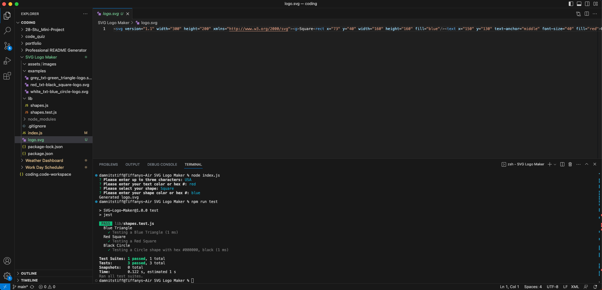

# SVG-Logo-Maker
 
  
  ## Description:
  A professional CLI SVG Logo Maker that generates a logo based on shape (circle, triangle & square), text & color.

  
  
  ## Questions:
  
  For any additional questions:
  
  Email:
  djamiranda@gmail.com
  
  GitHub:
  [https://github.com/djamiranda](https://github.com/djamiranda)
  
  Repo:
  [https://github.com/djamiranda/SVG-Logo-Maker](https://github.com/djamiranda/SVG-Logo-Maker)

  Video:
  [Google Drive Link](https://drive.google.com/file/d/1W3jZVEcwgNX2CGnm-_P0XKX2EGzZFEwu/view?usp=sharing)

